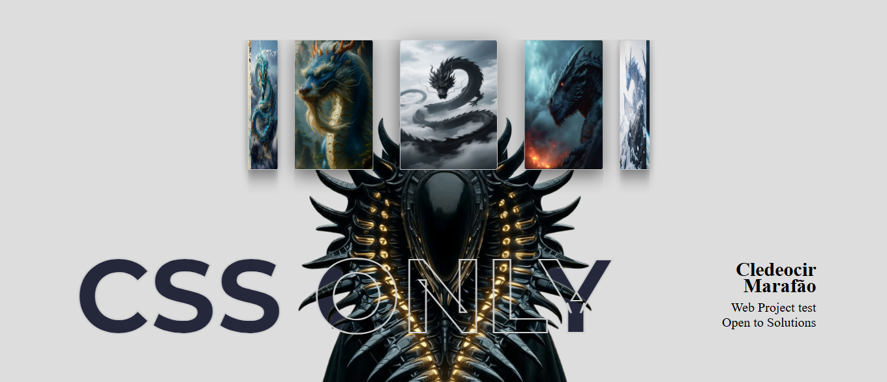

# 🐉 Projeto Carrossel 3D de Dragões

Este projeto apresenta um **carrossel 3D interativo feito com puro CSS**, com uma coleção de imagens de dragões em um círculo tridimensional. O efeito utiliza propriedades como **rotateY**, **translateZ**, **perspective**, **z-index**, e outras propriedades para criar uma experiência visual imersiva e envolvente.

## 🎯 Objetivo alcançado

Um carrossel que:
- Gira automaticamente em torno do eixo Y.
- Aplica **escala dinâmica** para destacar a imagem central.
- Recuo e profundidade com **efeito 3D curvado**.
- Sem uso de JavaScript — **CSS puro apenas**. 👾

## 🛠️ Tecnologias

- **HTML5**
- **CSS3**
- **Google Fonts**

---

## 📸 Demonstração

# Estado Inicial (Frontal) 
[]

# [Estado Iniciado] Efeito de Rotação com Escala
[]

---

# Deploy [ Acesse ]
[](https://cledeocirmarafao.github.io/projeto-dragon/)


# 📍 Como rodar o projeto localmente

**1** - Clone o Repositório

```bash
git clone https://github.com/usuario/projeto-dragões.git
```
**2** - Abra o arquivo **index.html**

```
open **index.html**

```

### Feito por [Cledeocir Marafão](https://github.com/cledeocirmarafao) 👾

---

## 🌐 Contatos

[](https://github.com/cledeocirmarafao)  
[](https://www.linkedin.com/in/cledeocir-maraf%C3%A3o-267768193/)  
[](https://www.frontendmentor.io/profile/cledeocirmarafao)